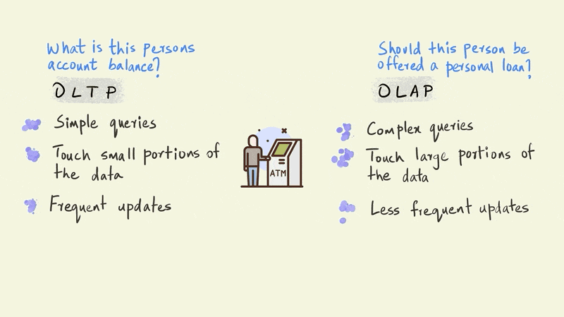

Traditionally, business activities with databases can be classified into two broad categories - Online Transaction Processing (OLTP) and Online Analytical Processing (OLAP).

Let’s start by understanding the differences between databases that deal with two types of business data -transactional and analytical.

Traditionally, business activities with databases can be classified into two broad categories - Online Transaction Processing (OLTP) and Online Analytical Processing (OLAP). 

<!-- -->

OLTP systems are designed to accurately capture and validate real time business transactions such as card swipes at a turnstile, movement of inventory, bank transactions, etc. 

Accuracy and speed are crucial for these systems since critical functions, such as a bank balance, need to be reflected immediately and without error for businesses to operate smoothly. 

OLAP systems on the other hand are designed to find meaning from data. Traditional OLAP systems tend to be slower, analyzing historical data in batches collected over a period of time. They are more concerned with the ability to execute complex analytical queries that can deliver business insights than they are with speed.
Let’s use an illustrated example of a person withdrawing money from an ATM to further understand the differences between OLTP and OLAP

A typical OLTP query in this scenario would establish whether this person has enough money in his account to make the withdrawal. An OLAP query, on the other hand, might evaluate whether this person should be sent an email offering a personal loan.

<!-- -->

The OLTP query is a simple one and requires the system to check only one thing: the amount of money this particular person has in their account. The OLAP query, however, is far more complicated. The model that determines whether a person should be offered a personal loan could involve the entire history of their account to simulate future cash flows, third party information on credit scores, and demographic information such as their age, income, education, etc. OLTP queries touch just a small portion of the data, such as an account balance, while OLAP queries bring together large portions of the data to provide an answer.

<!-- -->

If we zoom out a bit from this single withdrawal, we would also see that there are thousands of such withdrawals happening every minute across all of the bank’s ATMs. So although OLTP queries are relatively simple, their frequency is very high. 
OLAP queries, in contrast, can be executed less frequently. For instance, a company sending email offers on a monthly cadence would have to  run the particular OLAP query only once every month.

<!-- -->

This illustration presents a stark dichotomy between OLTP and OLAP.

In reality, however, there is a continuum between OLTP and OLAP depending on the type of business use cases. 

Moreover, cutting edge solutions like Kinetica are blurring these edges by blowing away some of the previous constraints faced by OLAP systems. Unlike traditional solutions that can only run their analytical models periodically in batches much after the data is collected, Kinetica is so fast that it can execute these complex queries in real time as the operational data is streaming in. This opens up a whole new suite of business opportunities that were previously impossible. 

For instance, now, we could send a message offering a loan to the person immediately after they perform a withdrawal - striking while the iron is hot - rather than at the end of the week or month.

<!-- -->
