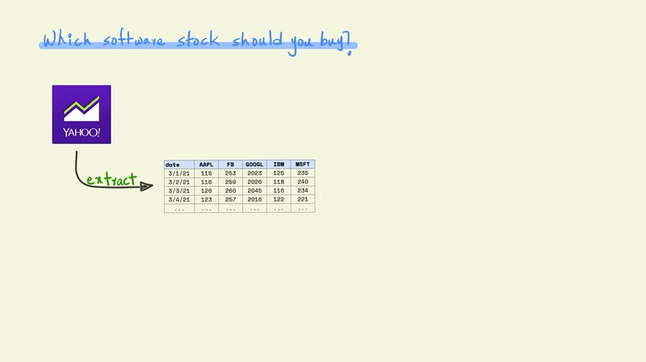

Let’s start by understanding what packages are and why they are so great.

## What is a package?
A package usually contains code, data and documentation.

<!-- -->

The code part usually contains a set of functions that we can use in our work. In Chapter <a href="#functions-intro"><strong>??</strong></a>, we discussed how functions allow us to encapsulate a series of operations. This function can then be repeatedly called to execute the same sequence of steps. Packages contain a collection of such functions that have been written and tested by someone else.

<!-- -->

## Why are packages useful?
Packages, can save us a tremendous amount of time and effort when conducting data analysis. Let's see how.

Imagine you are researching software stocks to invest in. You specifically want to examine past trends in price movement to predict the future.

<!-- -->

To do this research, you will first need to download historical price data for different stocks from a website or service like Yahoo Finance or Morningstar.

<!-- -->

Often, the downloaded data has errors, might be incomplete, and in a shape that is not suited for the analysis that you want to perform. So the first task is usually to tidy this data so that it is in a format that you can use. For instance, in the case shown below I transform the data from a wide format with stock names as columns to a long format where the stocks are represented as rows. There is a lot more to tidying data, which we will cover in chapter <a href="#tidy-data"><strong>??</strong></a>.

<!-- -->

The actual work that draws meaningful insight from the data often happens in an iterative manner. Very rarely do we find our answers in the first try and it often requires a series of steps that combine visualization, analysis and modeling and further transformations of the data till we can draw conclusions. 

<!-- -->

Once we have some conclusions that we can share, we can communicate these results. In a collaborative setting you would also need to communicate intermediate results with your research partner(s). So in these settings, communication can also be wrapped into the earlier iterative process of making sense of the data. 

<!-- -->

Packages help simplify all of these steps. Most tasks and problems that you encounter in your analysis are likely to have already been resolved in a different setting by someone else. For instance, consider the task of getting data from Yahoo Finance, someone else has probably done this using R before. Packages are a way to bundle these solutions along with some documentation so that you don't have to reinvent the wheel when solving the same problems again.

For example, in our case, the [tidyquant](https://business-science.github.io/tidyquant/) package contains a lot of functions for financial analysis. These can be used to directly download data from Yahoo Finance (or other sources), run popular financial models and visualize them. Similarly, other packages such as tidyr, ggplot, dplyr etc. provide general purpose tools and frameworks that can be applied to any data analysis project. And finally, packages like Rmarkdown and knitr make it really easy to communicate your results in a compelling manner in a wide variety of formats. 

<!-- -->

In a world without packages, you would need to write all the code needed to perform every step of your analysis. This would mean, code to download the stock data, clean it up, custom code to create financial models that you want to use, code for the analysis itself, and generating the charts and tables to include in a report or presentation to communicate the results.

The bulk of your intellectual work should be on analyzing whether a stock is a good investment or not i.e. making sense of the data. And packages free up your time by giving you well tested and effective solutions for tasks that are tangential to this purpose so that you can spend all your time on tasks that matter.
